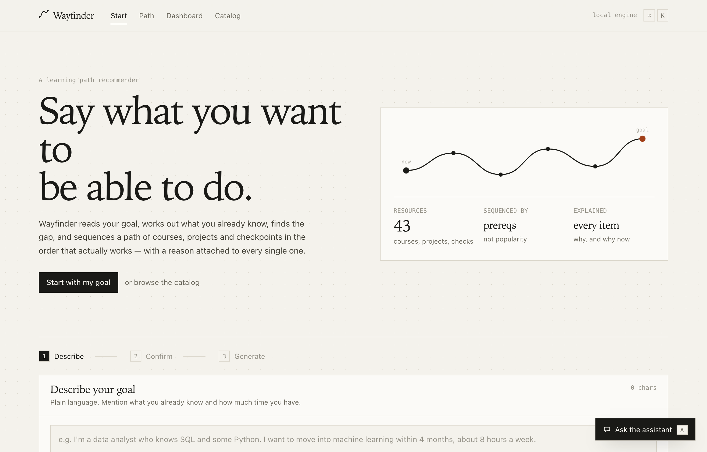
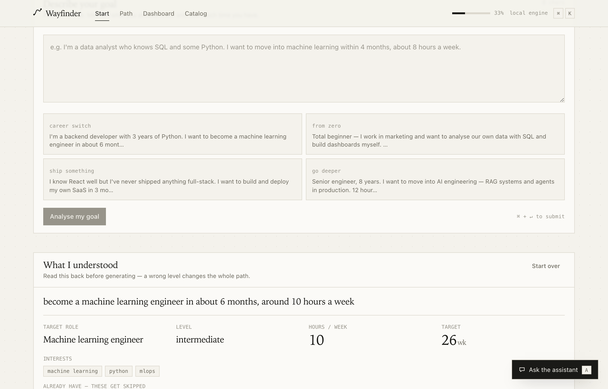
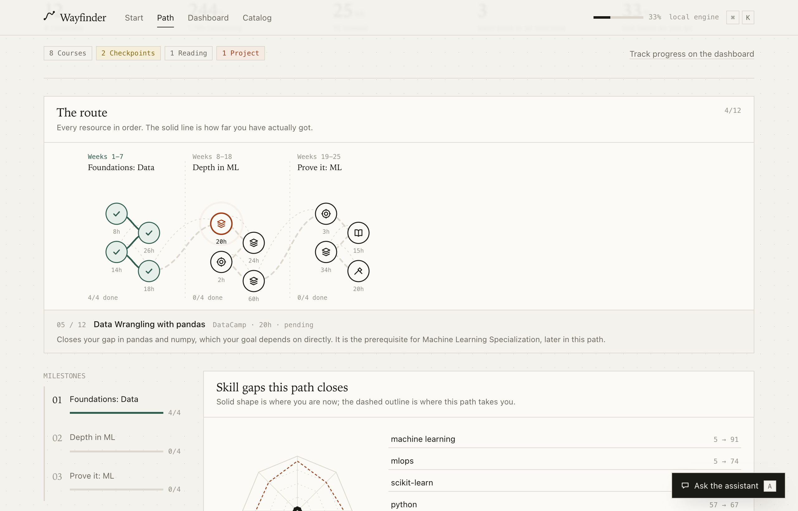
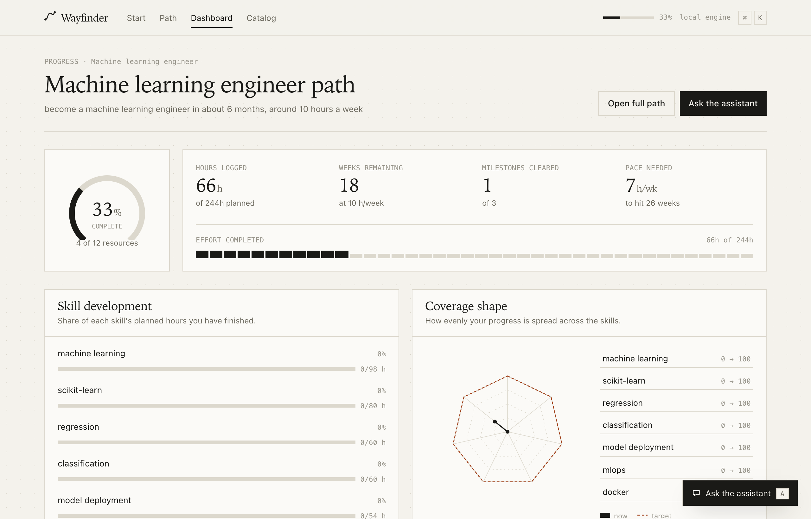
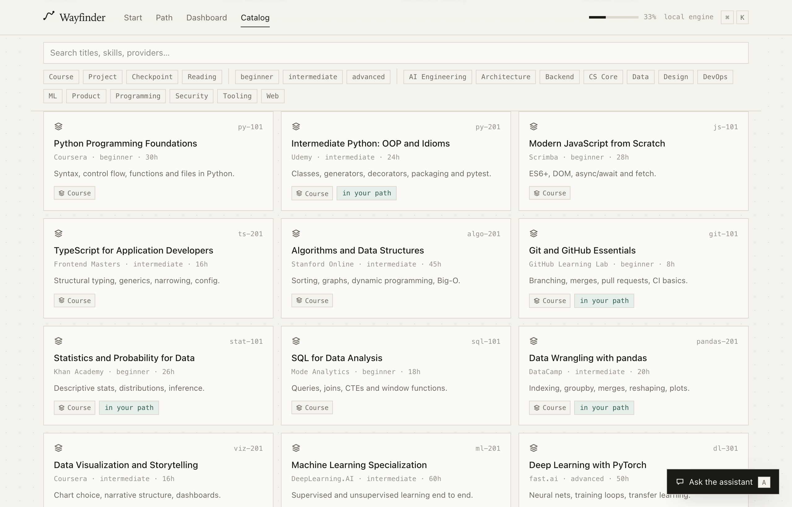
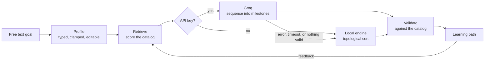

<div align="center">

# Wayfinder

**Describe what you want to be able to do. Get a learning path that actually sequences it.**

[](https://github.com/abjt01/wayfinder/actions/workflows/ci.yml)
[](https://nextjs.org)
[](https://react.dev)
[](https://www.typescriptlang.org)
[](#the-two-engines)

</div>



Wayfinder reads a goal written in plain language, works out what the learner already
knows, finds the gap, and sequences a roadmap of courses, projects and checkpoints —
prerequisites resolved, milestones that each end in something demonstrable, and a
reason attached to every single recommendation.

**It runs end to end with no API key.** Every AI feature has a deterministic
rule-based counterpart, so the product is fully functional the moment you clone it,
and upgrades to a Groq-hosted model the moment you add a key. Nothing is a stub.

---

## Contents

- [Quick start](#quick-start)
- [What it does](#what-it-does)
- [How a recommendation is made](#how-a-recommendation-is-made)
- [The two engines](#the-two-engines)
- [API](#api)
- [Project structure](#project-structure)
- [Configuration](#configuration)
- [Key rotation](#key-rotation)
- [Rate limiting](#rate-limiting)
- [Testing](#testing)
- [Continuous integration](#continuous-integration)
- [Deployment](#deployment)
- [Design](#design)
- [Known limitations](#known-limitations)

---

## Quick start

```bash
npm install
npm run dev          # http://localhost:3000
```

No key, no database, no services. To use Groq instead of the built-in engine:

```bash
cp .env.example .env.local   # add a key from https://console.groq.com/keys
npm run dev
```

### Docker

```bash
docker compose up --build    # http://localhost:3000
```

Or without compose:

```bash
npm run docker:build
docker run --rm -p 3000:3000 wayfinder
```

The container works with or without a key:

```bash
GROQ_API_KEY=gsk_... docker compose up --build
```

---

## What it does

| | |
|:--|:--|
| **Profile.** Free text becomes a typed profile — role, level, interests, existing skills, time budget. Everything inferred is shown back and stays editable, because a wrong level changes the whole path. |  |
| **Sequence.** The roadmap as a journey map: milestones as columns, resources as nodes, the solid line showing how far you actually got. Every item carries its own rationale and prerequisite note. |  |
| **Track.** Completion ring, hours logged, pace against target, per-skill development, milestone timeline, and a progress review that reads your real numbers and says what to do this week. |  |
| **Inspect.** The entire catalog the recommender draws from, filterable by kind, level and domain, with the entries already in your path marked. Nothing outside this list can be recommended. |  |

### Pages

| Route | What it is |
| --- | --- |
| `/` | The goal interview. Type in plain language, confirm what was understood, generate. |
| `/path` | The roadmap: journey map, skill-gap radar, milestone panels, per-item reasoning, and a feedback box that re-sequences everything. |
| `/dashboard` | Progress, pace, per-skill development, milestone timeline, and an AI progress review. |
| `/explore` | The whole catalog, filterable, showing what the recommender can draw from. |

### Interaction

- **⌘K** — command palette. Navigate, jump to any milestone or resource, mark the next item complete, ask the assistant, reset.
- **A** or **⌘J** — assistant drawer. Available on every page, keeps its transcript across navigation, streams token by token.
- Journey map nodes are hoverable, focusable and clickable; clicking scrolls to the resource.
- Scroll-spy milestone rail, reveal-on-scroll, count-up statistics, animated route drawing — all gated behind `prefers-reduced-motion`.

---

## How a recommendation is made



1. **Profile.** Free text becomes a typed `Profile` — goal, role, level, interests, known skills, completed courses, weekly hours, target weeks, preferences. Every field is clamped and validated server-side, then shown back to the learner to correct.
2. **Retrieve.** `retrieveCourses()` scores the catalog on token overlap with the goal and interests, nudges toward the learner's level, and pulls in the prerequisite closure of what it picks. **Only this slice is ever shown to the model**, which is why a recommendation cannot be invented.
3. **Sequence.** The slice is ordered into milestones with a per-item rationale, respecting prerequisites and the time budget.
4. **Validate.** `buildPath()` discards any course id not in the catalog, drops duplicates and anything already completed, and recomputes total hours from real catalog data. An unusable path is rejected rather than rendered.
5. **Adapt.** Feedback — "too long", "more projects", "start harder" — goes back with a digest of the current path, and the whole thing is rebuilt around it.

The catalog is 43 entries: 29 courses, 6 projects, 5 checkpoints and 3 readings across
13 domains, 882 hours in total, with prerequisites as real edges between them.

---

## The two engines

`lib/groq.ts` is tried first whenever a key exists — 45 second timeout, JSON mode, SSE
streaming. On a **missing key, an API error, a timeout, output containing no valid
catalog items, or a spent rate-limit budget**, the route falls through to
`lib/localEngine.ts` and the request still succeeds. Responses carry
`source: "groq" | "local"`; the chat stream carries an `X-Engine` header.

The local engine is not a placeholder:

- **Profiling** splits the text at the aspiration marker ("I want to…") and treats skills named in the *background* half as existing knowledge, so "3 years of Python, I want to be an ML engineer" correctly skips Python 101. Level comes from years-of-experience and self-description phrases; hours and deadlines from duration parsing.
- **Path building** is a topological sort over real catalog prerequisites, with greedy fill against the hour budget, guaranteed project and checkpoint coverage, and a pass that pushes checkpoints after the courses that teach their skills.
- **Coaching** is arithmetic over actual progress: pace needed against pace budgeted, hours remaining, stalled projects.

This is what makes the app demonstrable anywhere, and what keeps it up when Groq rate-limits.

---

## API

Every route validates its input, coerces the profile through `lib/profile.ts`, and
degrades rather than failing.

| Route | Body | Returns |
| --- | --- | --- |
| `POST /api/profile` | `{ message, previous? }` | `{ profile, followUp, source }` |
| `POST /api/path` | `{ profile, feedback?, currentPath? }` | `{ path, source }` |
| `POST /api/explain` | `{ courseId, profile, path? }` | `{ explanation, source }` |
| `POST /api/chat` | `{ messages, profile, path, completed }` | `text/plain` stream, `X-Engine` header |
| `POST /api/adapt` | `{ profile, path, completedIds, feedback? }` | `{ status, observations, nextActions, pathChange, source }` |
| `GET /api/health` | — | `{ ok, engine, model, catalogSize, features }` |

```bash
curl -s localhost:3000/api/profile \
  -H 'Content-Type: application/json' \
  -d '{"message":"I know SQL and some Python. I want to move into machine learning in 4 months, 8 hours a week."}'
```

---

## Project structure

```
app/
  api/            profile · path · explain · chat · adapt · health
  page.tsx        goal interview        path/       the roadmap
  dashboard/      progress              explore/    catalog browser
components/       PathMap · SkillRadar · ProgressRing · CommandPalette
                  AssistantHost · ItemCard · MilestoneSpine · ui primitives
lib/
  catalog.ts      the 43-entry catalog + keyword retrieval
  localEngine.ts  the deterministic counterpart to every AI feature
  buildPath.ts    validates engine output against the catalog
  progress.ts     every "how far through the path" derivation
  profile.ts      coerces any incoming profile into a complete one
  rateLimit.ts    per-IP ceilings guarding the key and the server
  keyring.ts      round-robin over several Groq keys, with cooldowns
  groq.ts         chatText · chatJSON · streamText
scripts/
  verify.ts            127 end-to-end assertions over the real HTTP API
  verify-rotation.ts   key rotation, against a stub Groq
```

---

## Configuration

| Variable | Required | Default | Effect |
| --- | --- | --- | --- |
| `GROQ_API_KEY` | no | — | A single key. Absent (and no pool) → deterministic local engine. |
| `GROQ_API_KEYS` | no | — | A comma-separated pool. Merged with `GROQ_API_KEY`; see [key rotation](#key-rotation). |
| `GROQ_MODEL` | no | `llama-3.3-70b-versatile` | Any Groq chat model. |
| `GROQ_API_URL` | no | Groq's completions endpoint | Point at an OpenAI-compatible proxy, or a stub in tests. |
| `BUILD_STANDALONE` | no | — | `1` emits `.next/standalone` for the Docker image. Set by the Dockerfile; leave unset everywhere else. |

---

## Key rotation

Groq's limits are **per key**, so a single key is the ceiling: the moment it
returns `429` the whole app drops to the local engine until the window resets.
Set a pool instead and requests round-robin across it.

```bash
GROQ_API_KEYS=gsk_one,gsk_two,gsk_three
```

Both variables are merged into one pool, so `GROQ_API_KEY` on its own still
works exactly as before. Whitespace is tolerated, duplicates are dropped.

| Response from Groq | What happens |
| --- | --- |
| `429` rate limited | That key sits out its cooldown — Groq's own `Retry-After` when it sends one, otherwise 60s — and the request immediately retries on the next key. |
| `401` / `403` rejected | Longer cooldown of 15 minutes, since a rejected key is usually wrong rather than busy. |
| Timeout or network fault | **No rotation.** Not the key's fault, and re-running a 45s timeout against every key in turn would turn a brief outage into a long one. Falls through to the local engine. |
| Every key cold | Falls through to the local engine, exactly as an unconfigured app does. Nobody sees an error. |

`GET /api/health` reports `keys: { configured, available }` — counts only, never
any key material. `available` drops as keys are rate limited and climbs back as
their cooldowns expire, which makes the pool observable in production.

```bash
npm run verify:rotation
```

That stands up a stub Groq and its own app instance, then asserts the whole
path: rotate past a rate-limited key, skip it while it is cooling off, and fall
back to the local engine once every key is spent. No real key is needed, which
is why it runs in CI.

---

## Rate limiting

Two per-IP ceilings in `lib/rateLimit.ts`, deliberately loose, guarding different things.

| Ceiling | Limit | On exceeding |
| --- | --- | --- |
| **Groq budget** | 30 / min | Falls through to the local engine and carries `X-Engine-Degraded: rate-limit`. Never an error — the learner still gets a path, the key just stops paying for it. |
| **Hard limit** | 120 / min | `429` with `Retry-After`. The only one that refuses. |

One bucket covers all routes, so the ceiling is on what a caller costs in total rather
than per endpoint. `/api/health` is exempt, so the container healthcheck never consumes
allowance. Counters live in process memory: behind N replicas the effective ceiling is
N times these numbers, which is fine for the protection intended. Put a shared store
behind `hit()` if you ever need an exact global limit.

---

## Testing

```bash
npm run dev        # in one shell
npm run verify     # in another — 127 assertions over the real HTTP API
```

`npm run verify` drives the actual HTTP surface rather than mocking it. It walks three
learner personas end to end (profile → path → explain → chat → coach → adapt) and
asserts the invariants that matter:

- prerequisites ordered, no invented courses, no duplicates, every item carries a rationale
- hours recomputed from the catalog, budgets respected, at least one project and one checkpoint
- streaming alive, and adaptation actually changing the path
- malformed and stale profiles coerced rather than crashing the route
- rate limiting enforced, but loose enough that a real session never meets it
- key rotation: round-robin, cooldowns, Groq's `Retry-After` honoured, recovery after the window
- every page rendering, and a 404 that 404s

Point it at any deployment with `VERIFY_BASE`. Requests carry a per-section caller
address, randomised per run, so the suite never trips its own limiter.

```bash
npm run lint              # eslint
npm run typecheck         # tsc --noEmit
npm run build             # production build
npm run verify:rotation   # key rotation, against a stub Groq
```

---

## Continuous integration

`.github/workflows/ci.yml` runs on every push and pull request to `main`, cancelling
superseded runs:

- **check** — install from the lockfile, lint, typecheck, build, boot the production server, run the full end-to-end suite against it, then run the key-rotation integration check. The build deliberately omits `BUILD_STANDALONE` so CI exercises the same output a managed host produces.
- **docker** — build the image, run it, wait for the healthcheck, then smoke test that it serves the app with no API key at all.

Nothing is published: the image is built and exercised, not pushed. Deployment stays
with the host's git integration; a registry login and push step slot into the docker
job when there is somewhere to send it.

---

## Deployment

Three-stage `Dockerfile` (`deps` → `builder` → `runner`) on `node:22-alpine`, shipping
only the Next.js standalone output, running as a non-root user, with a `HEALTHCHECK`
against `/api/health`.

Standalone output is **opt-in**, gated on `BUILD_STANDALONE=1`, which only the
Dockerfile's builder stage sets. Managed hosts package the app themselves and the extra
output trips their build. Keeping it conditional means one config serves both targets,
with no diverging file on a deploy branch.

---

## Design

Editorial paper-and-ink rather than dashboard-generic: a warm paper ground with a 1px
graph-paper grid, a serif display face for headings, hairline rules, tabular figures,
one rust accent plus green for complete and ochre for in-progress.

Every chart is hand-rolled SVG — journey map, radar, arc gauge, segmented meters — so
there is no chart library and no chart-library look. Deliberately avoided: gradient
glows, glassmorphism, purple-on-dark, status pills, all-caps letter-spaced eyebrows,
gradient text, emoji in the interface.

Verified in a real browser at 320, 375, 414, 768, 1024 and 1440 pixels: nothing
overflows its viewport on any page, and the console is clean.

### Stack

Next.js 16 (App Router) · React 19 · TypeScript strict · Tailwind CSS v4 · zustand with
localStorage persistence · Groq via raw `fetch`, no SDK. Four runtime dependencies in
total: `next`, `react`, `react-dom`, `zustand`.

---

## Known limitations

Honest about what is not finished. These live in retrieval and the local path builder;
none of them are interface bugs.

- **Retrieval is permissive.** The score threshold in `retrieveCourses()` can be met on level bonus alone, so a beginner asking for devops can see product and design entries surface.
- **Prerequisite closure is one level deep**, so a path can contain pandas without Python ahead of it.
- **Low weekly budgets overrun.** A minimum item count overrides the budget check, and the guaranteed project and checkpoint are appended without counting toward it.
- **Completed courses are matched loosely.** Matching needs one title to contain the other, which free text rarely satisfies.
- **Age is read as experience.** "I'm 25 years old and a total beginner" profiles as advanced.

`npm run verify` stays green through all of these because it only checks the ordering
of prerequisites already present in the path. Fixing the first two should come with
assertions for external prerequisite coverage and budget ratio.

### Scope

- State is per-browser `localStorage`. No database, no auth — swap `lib/store.ts` for a server store to make it multi-user.
- The catalog stands in for a real platform's course database. Replace `CATALOG` in `lib/catalog.ts`, keep the prerequisite ids valid, and everything else keeps working.
- Catalog URLs point at real provider landing pages. Project and checkpoint entries are Wayfinder-native and have no external link.
